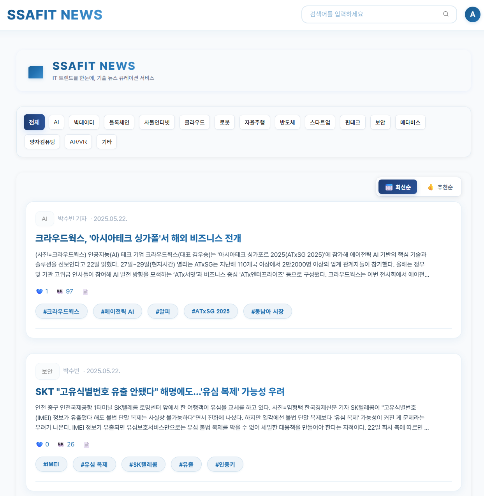
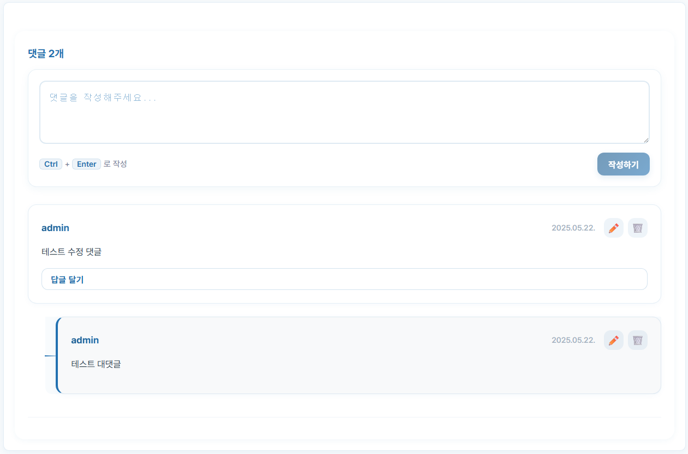
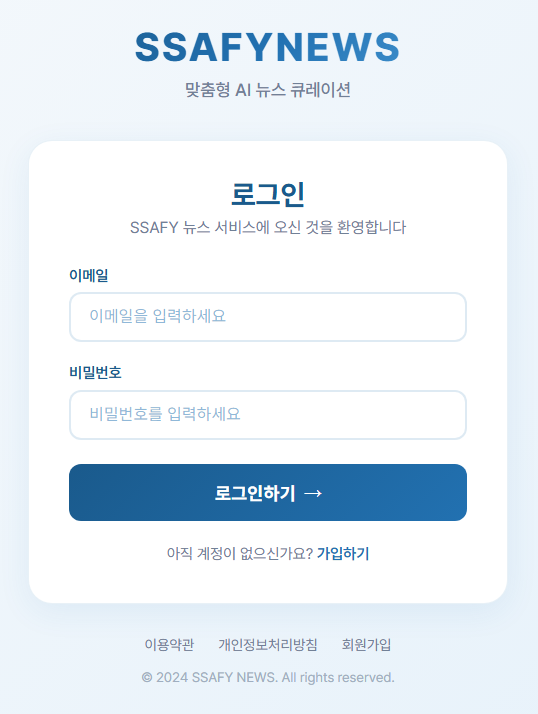
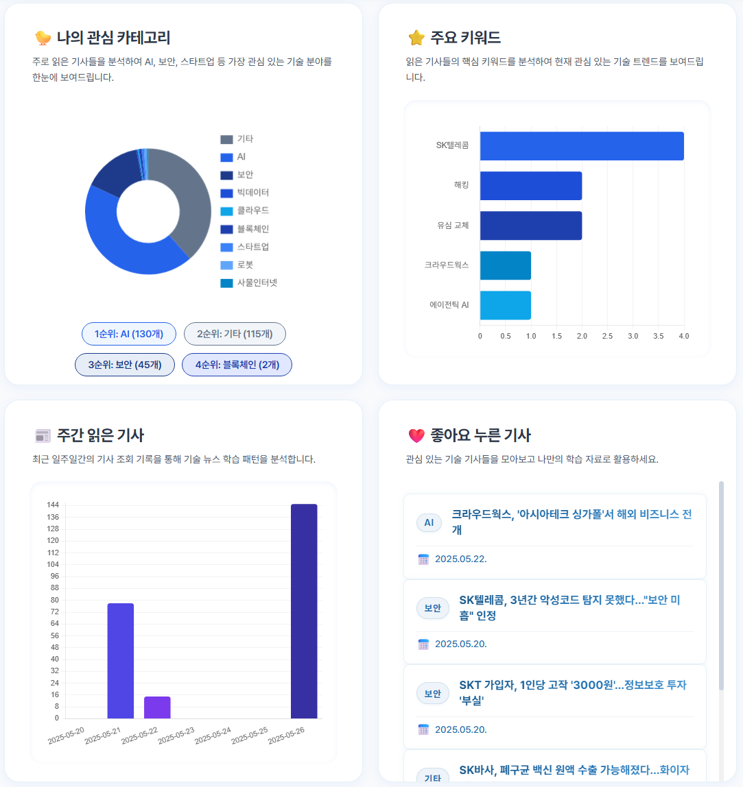
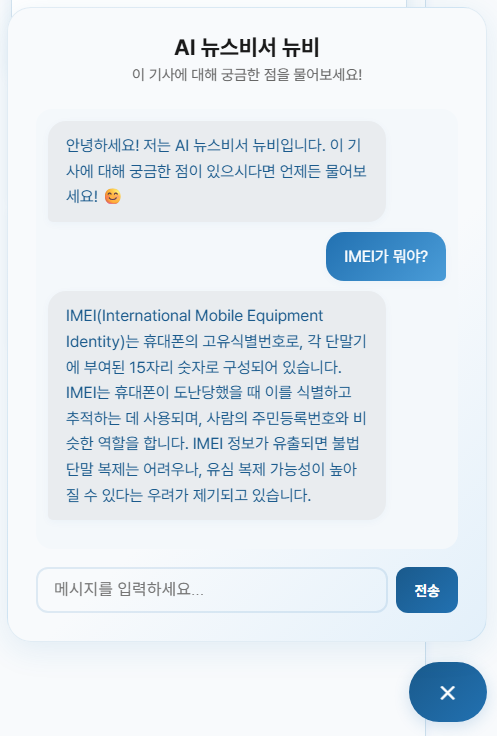
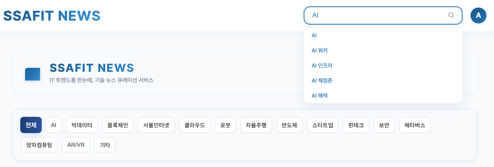
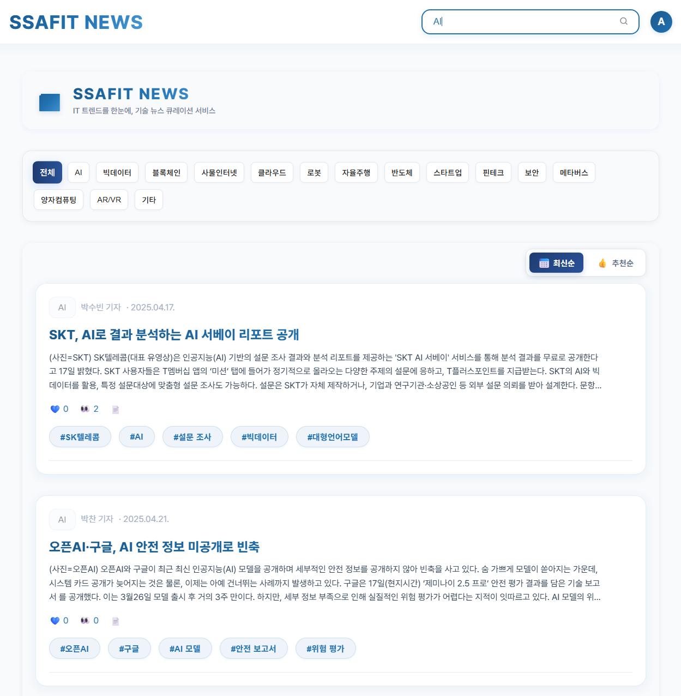
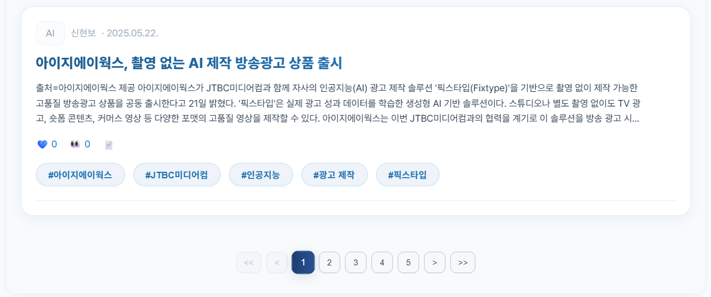

# 📰 SSAFIT NEWS - Frontend

Vue 3 기반의 **AI 뉴스 큐레이션 플랫폼** 프론트엔드입니다.  
사용자가 뉴스 목록을 탐색하고, 뉴스 상세 내용을 확인하며, 좋아요 및 관련 기사를 함께 확인할 수 있도록 구성되어 있습니다.

## 📦 기술 스택

- **Vue 3 (Composition API)**
- **Vite**
- **SCSS**
- **Axios**
- **Vue Router**
- **Chart.js**

## 🚀 실행 방법

```bash
npm install
npm run dev
```

## 📂 프로젝트 구조

```bash
src/
├── assets/
│   ├── data/
│   │   └── tabs.js          # 카테고리 탭 데이터
│   └── icons/               # SVG 아이콘
├── components/
│   ├── NewsCard.vue         # 뉴스 카드 컴포넌트
│   ├── ArticlePreview.vue   # 관련 기사 미리보기
│   ├── NewsAssistant.vue    # AI 뉴스비서 뉴비
│   ├── CommentList.vue      # 댓글 목록 및 관리
│   ├── CommentItem.vue      # 개별 댓글/대댓글
│   ├── CommentForm.vue      # 댓글/답글 입력 폼
│   └── icon/                # 아이콘 컴포넌트
├── common/
│   ├── ContentBox.vue       # 공통 컨텐츠 박스
│   ├── StateButton.vue      # 상태 버튼
│   └── PaginationButton.vue # 페이지네이션
├── composables/
│   ├── useDate.js           # 날짜 포맷팅
│   └── useAuth.js           # 인증 상태 관리
├── views/
│   ├── NewsView.vue         # 뉴스 목록
│   ├── NewsDetailView.vue   # 뉴스 상세
│   ├── DashBoardView.vue    # 개인화 대시보드
│   ├── LoginView.vue        # 로그인
│   └── RegisterView.vue     # 회원가입
└── router/
    └── index.js             # 라우터 설정
```

## ✨ 구현 기능

### 📄 1. 뉴스 목록 페이지 (`NewsView.vue`)

- 뉴스 목록을 최신순 / 추천순으로 정렬
- 카테고리 탭을 통한 필터링
- 페이지네이션 (이전/다음 + 페이지 번호)
- 각 뉴스는 `NewsCard`로 렌더링
- 반응형 디자인 적용



### 🧾 2. 뉴스 상세 페이지 (`NewsDetailView.vue`)

- 제목, 작성자, 작성일, 본문 출력
- 태그 키워드 표시
- 좋아요/조회수/기사 링크 표시
- 좋아요 버튼 클릭 시:
  - 상태 토글 (하트 UI + 카운트 애니메이션)
  - 서버에 POST / DELETE 요청 전송
- 관련 기사 출력 (`ArticlePreview.vue`)
- AI 뉴스비서 뉴비와 대화 기능


### 💬 3. 댓글 기능

- 뉴스 상세 페이지에서 댓글 및 대댓글(답글) 작성 가능
- 본인 댓글/답글에 한해 수정 및 삭제 가능
- 대댓글은 댓글 바로 아래, 계층적으로 구분선과 함께 표시
- 실시간으로 댓글/답글 목록 갱신
- 무채색 기반의 깔끔한 UI, 접근성 고려
- 키보드로도 댓글 입력 및 버튼 조작 가능



### 🔐 4. 인증 기능

- 로그인 (`LoginView.vue`)
  - 이메일/비밀번호 로그인
  - JWT 토큰 기반 인증
  - 로그인 상태 유지
- 회원가입 (`RegisterView.vue`)
  - 사용자 정보 입력
  - 비밀번호 확인
  - 가입 완료 시 로그인 페이지로 이동

<div style="display: flex; gap: 20px;">
  
  
</div>

### 📊 5. 개인화 대시보드 (`DashBoardView.vue`)

- 나의 관심 카테고리 분석
  - 도넛 차트로 카테고리별 관심도 시각화
  - 순위별 카테고리 태그 표시
- 주요 키워드 분석
  - 자주 읽은 기사의 핵심 키워드 추출
  - 수평 바 차트로 키워드 빈도 시각화
- 주간 읽은 기사 통계
  - 일별 기사 조회 수 그래프
  - 학습 패턴 분석
- 좋아요 누른 기사 모음
  - 관심 기사 모아보기
  - 빠른 재접근 기능



### 🤖 6. AI 뉴스비서 뉴비 (`NewsAssistant.vue`)

- 기사 내용 기반 질의응답
- 실시간 채팅 인터페이스
- 로딩 상태 표시
- 에러 처리 및 사용자 피드백



### 🔍 7. 뉴스 검색 기능

- 헤더 검색바를 통한 실시간 뉴스 검색
- 검색 결과 페이지네이션
- 카테고리별 검색 결과 필터링
- 검색어 하이라이팅
- 키워드 기반 검색어 자동완성
  - 입력한 검색어와 유사한 키워드 추천
  - 키보드 방향키로 추천 검색어 선택 가능
  - 마우스 클릭으로 추천 검색어 선택 가능
  - ESC 키로 추천 목록 닫기
- 태그 기반 검색 기능
  - 뉴스 카드의 태그 클릭 시 해당 키워드로 검색
  - 검색어가 헤더 검색창에 자동으로 입력
  - 검색 결과 페이지로 즉시 이동




### 🧠 8. 기타 구성 요소

- `useDate()`를 통한 날짜 포맷
- `useAuth()`를 통한 인증 상태 관리
- `StateButton` / `ContentBox` 등 공통 컴포넌트
- `ArticlePreview.vue`: 관련 뉴스 요약 카드

